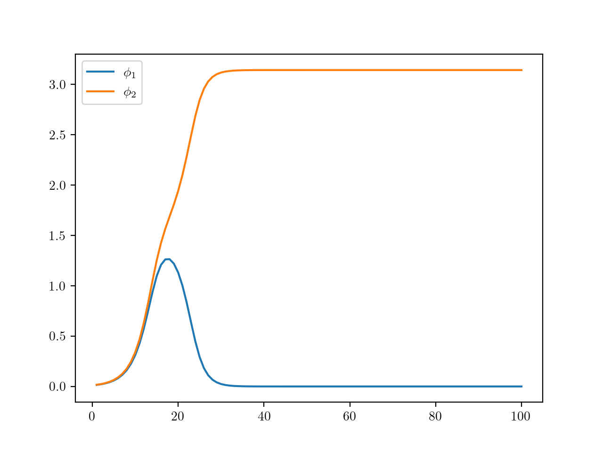
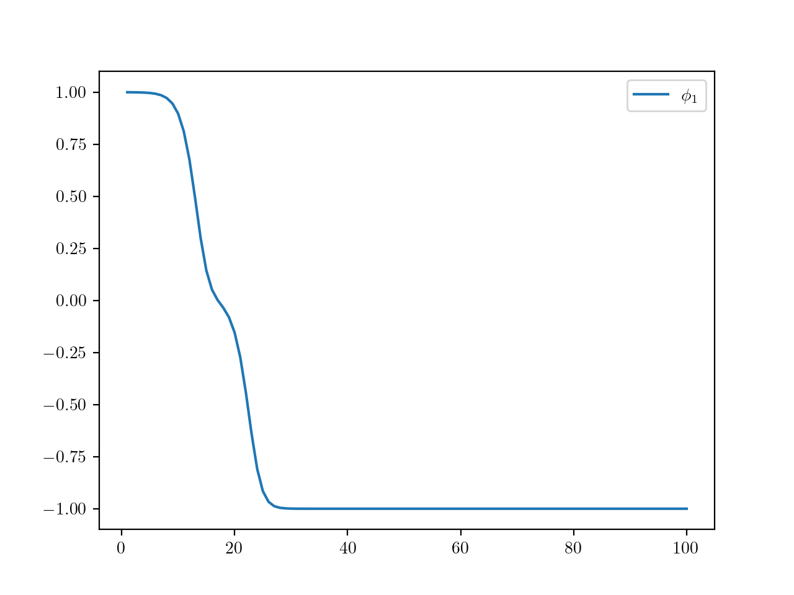

# DiegoHerrera262's Project Log 2021-1

**Date:** 10/03/21
**Topic:** Variational Circuits

Today I discovered Xanadu's tools for Quantum Machine learning, and got a grasp on the fundamentals of hybrid computing on this area. Also, the name of the packages is pretty fun. I still have not been very acquainted with the full details of QML. However, I can tell that the main principle, according to Xanadu, is to use simple **Quantum Nodes**, that carry out subroutines that are computationally expensive on a classical computer. This may include a feature map or the computation of a cost function.

> The most remarkable feature of Xanadu's interface for NISQ QML is that their software allows *gradient computation* without much effort.

As far as I'm concerned, Xanadu allows simulation of digital processors and optical devices. They have two default simulators: ```default_qubit``` and ```default_gaussian```. For digital and optical devices respectively. Furthermore, they allow usage of other companies' devices. The trick is that user must install so called **plug-in**s or define a custom one. The funniest plug-in is called *StrawberryFields*. This is for continuous variable (optical) computation simulation.

The actual python library is called ```pennylane```. I see that this can be quite useful for learning at prototyping at least. Hence I proceeded to install it. There is some scatetred information, that I intend to summarize here. First, I explain how to install the packages on a MacOS device. Then, I explain how to install ```pennylane-sf``` plug-in for using StrawberryFields. After that, I explain how to interface it with Qiskit using ```pennylane-qiskit```.

**IMPORTANT:** I am using PC with MacOS BigSur 11.2.3. I do not know how to install any of this packages on Windows, but presume installation on a Ubuntu-based device might not be too different.

### Environment setup

To this date, although latest Python version is 3.9.2, I discovered that this version is not compatible con all plug-ins. Therefore, I set up a conda environment with python 3.8. This can be done by the command

```bash
conda create -n QML python=3.8
```

**IMPORTANT:** I suggest using Ananda Python as default distro. This is because it allows easy environment management and ensures compatibility most of the times. This can be downloaded from the [official website](https://www.anaconda.com/products/individual). I suggest using command line installer rather than graphical installer. Sometimes the former may not link path variables properly.

Any time I work on Quantum Machine Learning, I will activate my environment using command

```bash
conda activate -n QML
```

### Installing PennyLane

PennyLane is the Python package built by Xanadu for Quantum Machine Learning. The general structure is that it interfaces NumPy, PyTorch or TensorFlow with a QPU. The QPU performs what are called **Quantum Nodes** or QNodes, which are subroutines where a QPU might give a substantial speed up. As mentioned earlier, the main feature of PennyLane is that it allows quantum computation of **gradients**, which simplifies a lot development of hybrid QML algorithms.

To install this package, I activated my conda environment, and ran the command

```bash
pip install pennylane
```

This did the job for me. I link here the [official page](https://pennylane.ai/install.html) where all the installation instructions can be found.

**NOTE:** I tried installing wrappers for NumPy and PyTorch, but found all requirements were already satisfied by the afore mentioned command.

### Installing StrawberryFields simulator

As mentioned earlier, PennyLane already has two default simulators. However, some tutorials make use of StrawberryFields for continuous variable computations. So I decided to install the plug-in anyway. Plus, I love the name of the packages.

To be able to use the plug-in, I ran the command

```bash
pip install pennylane-sf
```

This did the job. I link here the [installation instructions](https://pennylane-sf.readthedocs.io/en/latest/installation.html) for more details.

### Installing Qiskit Plug-in

The best part to me is that PennyLane can be interfaced with many other quantum computing libraries and services. At this stage, I only use IBM Q. Therefore, I only see necessary to install Qiskit plug-in. This will allow me to simulate QML algorithms with ```qsm_simulator``` from Qiskit Aer, but more important... I will be able to execute them on a real IBM Q device. This step is little tricky. I did what produced no error messages, but haven't tested it yet.

First, install the plug-in pretty much like StrawberryFields

```bash
pip install pennylane-qiskit
```

I already had Qiskit installed on my computer. However, if it were not installed, this command would have resolved dependencies. As is well known, execution of a quantum algorithm in an IBM Q device requires a user account. An IBM Q account has a unique token that is called by Qiskit to run a quantum circuit on a superconducting device. The way PennyLane does this is by a ```config.toml``` file, located at an specific path, which depends on the OS ([see here](https://meet.google.com/edb-vjvo-xix)). On MacOs, this path is

```bash
~/Library/Preferences/pennylane
```

Supposedly, PennyLane installation generates this file. However, I had to create it myself. The content depends on user preferences. The most important part is to include IBM Q token for remote execution. I will not paste all the contents of the file here, but refer [here](https://github.com/carstenblank/pennylane-qiskit) for further information.

**IMPORTANT:** Make sure you have an IBM Q account.

### Installing PyTorch

It is possible that I need PyTorch for some hybrid algorithms. Therefore, I installed it. The documentation can be found [here](https://pytorch.org). The installation was carried out with ```conda```

```bash
conda install pytorch torchvision torchaudio -c pytorch
```

My plan now is to follow PennyLane Tutorials for QML. The first in my list is a simple variational circuit that implements an X gate from two rotations. [Here]() are the tutorials I will follow.

## Basic Tutorial: Qubit rotations

Well, now that everything is installed, I set out to building my first variational circuit with PennyLane. This consists on a single wire, with two rotations around axes x and y, with angles $\phi_1$ and $\phi_2$

<p align="center">
  
</p>

The tutorial may be accessed [here](https://pennylane.readthedocs.io/en/user-docs-refactor/tutorials/pennylane_run_qubit_rotation.html#qubit-rotation). They discuss a bunch of mathematics that is left for the unexperienced reader. However, I will not reproduce it because the important part is the essence

> The goal is to determine values for $\phi_1$ and $\phi_2$ such that the circuit emulates the action of a Pauli $Z$.

The solution they propose is quite interesting to me. At first, they point out that the expected value of Pauli $Z$ can be used as a **cost function**, which assess if our parameter selection is good or bad. The nearer $\langle\psi_f|Z|\psi_f\rangle$ to $-1$, the better the parameters chosen.

> Basically, what they suggest doing is executing the circuit, and evaluating $\langle\psi_f|Z|\psi_f\rangle$ using statistics. A classical control uses this value as a cost function. An optimization method is used then to tune the parameters until expected value converges to a minimum, which implies that the lowest eigenvalue state has been prepared ($|1\rangle$).

**IMPORTANT:** This session can be recreated from ```Notebooks/QubitRotation.py```

### Implementation with PennyLane

So, I started by importing PennyLane and NumPy using the wrapper as suggested

```python
import pennylane as qml
from pennylane import numpy as np
```

No error was produced by these 2 commands. I point out that Xanadu suggests that user always import NumPy from the wrapper. After that, a **quantum device** must be installed. This is sort of like the infrastructure that runs the algorithm. It can be a simulator or a real device. However, to use real devices, the appropriate plug-ins must be installed. They use the default digital simulator for this example. A quantum device is called by a command of the form

```python
device = qml.device('backend_name', wires=NUM_QUBITS)
```

I expect that the notation is sufficiently clear. Tested the function with ```default.qubit```, and ran without error. I expect to test it with StrawberryFields and IBMQ_Rome in the near future. Execution of an algorithm is based upon **QNodes**. These are like quantum functions. They are supposed to provide the quantum speed up to a classical computation. The QNode used in the tutorial is

```python
def circuit(phis):
  qml.RX(phis[0], wires=0)                  ## Perform X rotation
  qml.RY(phis[0], wires=0)                  ## Perform X rotation
  return qml.expval(qml.PauliZ(0))          ## Compute Z expected value
```

This way has some disadvantages at first glance. I don't seem to be able to plot the circuit, and cannot visualize directly the statevector of the qubit in the Bloch sphere, like with Qiskit. However, *measurement of operators is remarkably easy*. With Qiskit I would have to use Aqua, and it is not at all clear how to implement it on a device without explicitly post-processing the histogram. So this is cool.

**SUPER IMPORTANT:** A decorator must be used to link a QNode with a particular device. Also, QNodes can only include quantum operations, one operation per line, and return **measured observables**. The decorator is of the form

```python
@qml.qnode(device)
def myqnode(params):
  ## Some quantum operations
  return observables
```

**IMPORTANT:** Kwarg ```wires``` receives a list with all the qubits upon which the desired quantum operation acts. It is a shame that no visualization tool is explicit, but I think that PennyLane is for pros that can visualize their circuit on their heads.

Before implementing a circuit, it is healthy to check the operations supported by a device. I think that most of the time we might be using Qiskit Backends. Therefore, I expect no trouble here. However, it is not a bad idea to chek operations for both default backends and StrawberryFields from PennyLane.

> What blows my mind is that the function can be used as a common Python function. PennyLane makes a very nice integration of the quantum part and the classical control. This platform might be awesome for VQE in Quantum Chemistry.

The scripts tend to be a bit slow. As mentioned earlier, some of the profits of using PennyLane is that gradients can be computed by quantum circuits. This can be done by a instruction of the form

```python
circuit_gradient = qml.grad(circuit, argnum=INDEP_VARS)
```

Where ```INDEP_VARS``` is but a list with the indexes of the ```params``` with respect to I would like to differentiate. For optimization, however, PennyLane has built-in functions, and this example doesn't provide explicit need for computation of gradient. What they do is wrap the QNode with a common Python function, and apply an optimizer.

Optimization starts by defining initial parameter values. After that, an optimizer is initialized using the instruction

```python
optimizer = qml.GradientDescentOptimizer(stepsize=STEP)
```

I think that if someone is reading this, he or she might have some intuition about what Gradient Descent means. I repeat an optimization step several times. The optimizer then produces the set of parameter values that minimize cost function. The details of the code necessary for this step are included on the Python script.

First, I illustrate convergence of the rotation angles

<p align="center">
  
</p>

Finally, I illustrate that minima is obtained

<p align="center">
  
</p>
